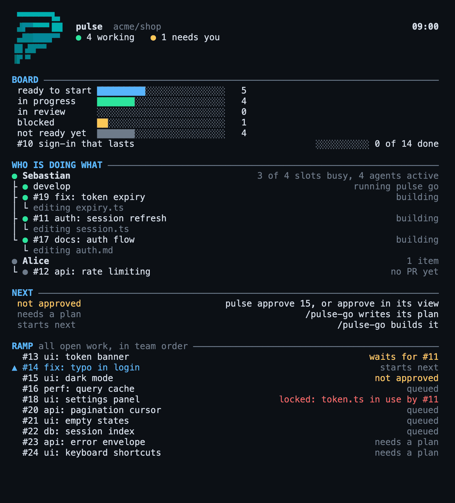

# Pulse

> **When code costs almost nothing, the plan becomes the product.**

Pulse is how a team builds with coding agents. Every idea goes through a method before code gets written. Epics and features live in your repository next to the code. Everyone, people and agents, sees the same board, and all ready work gets built in parallel without two agents getting in each other's way.

**Documentation:** [pssah4.github.io/pulse](https://pssah4.github.io/pulse/)

<p align="center">
  
</p>

Runs in **Claude Code** and **Codex**, in the terminal and in the VS Code extension. Support for GitHub Copilot, Cursor, Gemini CLI, and OpenCode will follow.

## Three parts

| Part | What it gives you |
|---|---|
| **Operating model** | A rhythm for teams where each person works with several agents: three tempos (hourly, daily, every two weeks), a conscious filter that decides what becomes work, roles as hats. |
| **Collaboration** | One shared board, a ramp that hands out ready work in the right order, `pulse go` to build all of it in parallel, and the live map above in your terminal (`pulse map`). |
| **Digital Innovation Agents** | The method: one command per step from a raw idea to reviewed code. Business analysis, requirements, plan, build, test, security audit. |

## Where the work lives

You never write tickets on GitHub. Business analyses, epics, features, and plans are Markdown files in `_devprocess/`, written by the agents together with you and reviewed in pull requests like code. GitHub keeps the board: one small record per item (type, ready, who has it, what it waits for, done), and only the `pulse` command writes it. Agents ask instead of reading: `pulse status --json` answers "what can I start?" from a local cache.

## Commands

| Command | Does |
|---|---|
| `/pulse` | where things stand, what comes next |
| `/pulse-ba` | business analysis: problem, users, jobs to be done, critical hypotheses |
| `/pulse-re` | epics and features with success criteria free of technology, registered on the board |
| `/pulse-build` | test first, smallest change, done only when a user can reach the feature; also tests for existing code |
| `/pulse-audit` | OWASP Top 10, LLM Top 10, static analysis, dependencies, supply chain |
| `/pulse-go` | build every ready item in parallel, one worktree and one agent each |
| `/pulse-map` | the live map in your terminal |
| `/pulse-setup` | switch Pulse on in a project |
| `/pulse-realign` | take over existing code, or move a project from the Digital Innovation Agents plugin |

## Innovation methodology, not just automation

The business analysis and requirements steps carry 34 innovation methods (qualitative interviews, extreme users, fly on the wall, cultural probes, persona synthesis, jobs to be done, brainwriting, TRIZ, wizard of oz, pre-mortem, and more) as [method cards](https://pssah4.github.io/pulse/reference/methods-discovery). When your answers go thin, the agent stops the interview and proposes the matching field method. The research itself stays human: interviews with real users, observation in the real context, prototypes in real hands.

## Quick start

You need Python 3.9 or newer, the GitHub CLI `gh` 2.94 or newer, and a GitHub repository.

In Claude Code:

```bash
claude plugin marketplace add https://github.com/pssah4/pulse.git
claude plugin install pulse@pssah4-skills
```

In the Codex CLI:

```bash
codex plugin marketplace add pssah4/pulse
codex plugin add pulse@pssah4-skills
```

Then, in your project: `/pulse-setup` (in Codex, trust the Pulse hooks when Codex asks at its first start, under `/hooks` in the CLI or one by one on the Hooks page of the IDE extension's settings, and call it `$pulse:pulse-setup`), which also offers the `pulse` command for your terminal, and `/pulse` from there on. The VS Code extensions, updates, and removal: [Installation](https://pssah4.github.io/pulse/tutorials/installation).

## Coming from the Digital Innovation Agents plugin

Pulse replaces the Digital Innovation Agents plugin (DIA, versions up to 4.0.2). Remove the old marketplace, install Pulse, and run `/pulse-realign` once per project: it moves the settings and turns the old `BACKLOG.md` into records on the board. The steps: [Installation](https://pssah4.github.io/pulse/tutorials/installation#coming-from-the-digital-innovation-agents-plugin).

## Design principles

1. Understand the problem before designing the solution.
2. Separate what the system does (observable, free of technology) from how it does it (the plan, decision records).
3. Every fact has one home: content in the repository, item state on GitHub, rules in hooks, truth in the code.
4. Everything a script can decide, a script decides: claims, dependencies, the ramp, the checks.
5. No claim of success without fresh evidence from this turn.

## License

MIT License. Copyright (c) 2025 Sebastian Hanke. See [LICENSE](LICENSE).

## Acknowledgments

Innovation methodology from design thinking and lean startup practice, the Jobs-to-be-Done framework, arc42, MADR, the OWASP Top 10 and LLM Top 10, and the AAA pattern and FIRST principles for testing.
