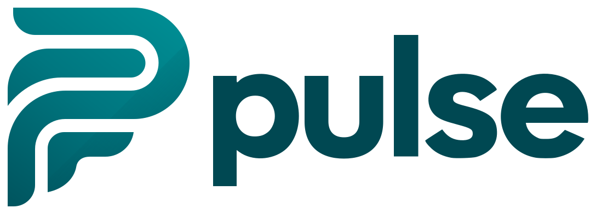

<h1 align="center">
  <picture>
    <source media="(prefers-color-scheme: dark)" srcset="docs/public/assets/pulse-logo-aqua.svg" />
    
  </picture>
</h1>

> **One team. One pulse.** Coordinate coding agents across developers and machines.

Each developer runs Claude Code or Codex in their own clone. Pulse registers work while it is being scoped, so teammates can see who is working on what before implementation starts. Each person's `pulse go` claims work and uses dependencies and planned files to decide what can run alongside the team's other work.

Pulse takes each item through planning, implementation, tests, review and security audit to integration. Regular checked results integrate automatically; manual final approval is an option. GitHub hosts the item board, versioned work and shared Pulse state. No additional coordination service needs to be operated, and agents run on your own machines and subscriptions.

**Documentation:** [pssah4.github.io/pulse](https://pssah4.github.io/pulse/)

An illustrative excerpt of `pulse map` in a sample project:

```text
 ▀▀▀▀▀▀▜▄
 ▟▛▀▀▀▀▐█▌  pulse  acme/shop                                               09:20
 ▄█████▛▀   ● 4 working   ● 2 need you   ● 1 failing
▐█▗█▛▀▘
▐▛▝▘

WHO IS DOING WHAT ──────────────────────────────────────────────────────────────
● Sebastian                                   4 of 4 slots busy, 4 agents active
├ ● #19 fix: token expiry                                               building
├ ● #11 auth: session refresh                                     review running
├ ● #17 docs: auth flow                                                fix round
├ ● #20 api: pagination cursor                                          building
└ ● #14 fix: typo in login                            waits for manual approval
● Alice                                                                  2 items
├ ● #12 api: rate limiting                                             planning
└ ● #23 api: error envelope                                    spec in progress
● Bob                                                                     1 item
└ ● #16 perf: query cache                           tests failed, work preserved

RAMP all open work, in the order it goes out ───────────────────────────────────
  #13 ui: token banner                                             waits for #11
  #15 ui: dark mode                                                      on hold
  #18 ui: settings panel                          locked: token.ts in use by #11
  #21 ui: empty states                                                    queued
  #22 db: session index                                                   queued
  #24 ui: keyboard shortcuts                                        needs a plan
```

Runs in **Claude Code** and **Codex**, in the terminal and in the VS Code extension. Support for GitHub Copilot will follow.

## How a team shares the work

1. **Register while scoping.** `/pulse-ba` and `/pulse-re` create draft records as work begins. Specs and Plans stay on item branches; the Map combines the board with confirmed claims and progress from shared Pulse state.
2. **Run locally, coordinate with the team.** Each person starts `pulse go` in their clone. It claims work, starts agents in separate worktrees, and holds back items whose planned files overlap work already claimed by a teammate.
3. **Integrate a checked result.** The runner executes the project's tests, review and security audit. Final approval binds the exact result and base, automatically by default or under a chosen manual policy. Pulse then merges and pushes with the project's hooks.

Reservations depend on the planned file lists. Actual edits can still conflict. Shared Git revisions serialize competing claims; a stale update cannot replace a newer holder. The shared map shows item ownership, phase, and heartbeat; detailed tool activity stays local. See [parallel work](https://pssah4.github.io/pulse/concepts/parallel-work) for the boundaries and handover rules.

Pulse fits teams that want this shared workflow and are willing to maintain specs and plans. For other coordination needs, see [Choosing a coordination tool](https://pssah4.github.io/pulse/concepts/choosing-a-coordination-tool), a sourced comparison with Commons and agent-sync with task-pipeline.

## Three parts

| Part | What it gives you |
|---|---|
| **Operating model** | A rhythm for teams where each person works with several agents: three tempos (hourly, daily, every two weeks), a conscious filter that decides what becomes work, roles as hats. |
| **Collaboration** | A shared board across people and machines, an ordered queue, `pulse go` to run local agents against it, and `pulse map` to see the team's work. |
| **Digital Innovation Agents** | The method: one command per step from a raw idea to reviewed code. Business analysis, requirements, plan, build, test, security audit. |

## Where the work lives

Business analyses, epics, features and Plans are Markdown files in `_devprocess/`, versioned with the code. A published valid spec permits planning; a valid published Plan permits building when dependencies and reservations allow it. Each item keeps its branch and worktree through these phases.

GitHub issues provide the visible item records, hierarchy, dependencies and findings. The dedicated `pulse-state` Git branch holds confirmed claims, holds, results, approvals and integration state. Local actions are saved in a durable SQLite outbox before background synchronization. `queued` or `syncing` means local intent; only `confirmed` changes team authority. The Map and `pulse status --json` combine these sources. [Where things live](https://pssah4.github.io/pulse/concepts/where-things-live) explains their roles.

Regular checked results integrate automatically by default. A person with repository write access can choose manual final approval. Either policy binds the exact result head and current base; changed code, holds or withdrawn approval stop integration. Project Git hooks remain enabled, and destructive removal keeps its separate explicit confirmation.

## Run the queue, with an optional goal

`pulse go` works through the queue. Add a sentence for an additional objective, for example:

```bash
pulse go finish the items in Epic 4 and investigate the UI problem
```

Pulse interprets the complete request in a finite native agent session, reuses existing work and registers new items before starting their writers. New epics, features, improvements and fixes follow the normal workflow, with the associated BA, requirements and decision documents. An explicit `only` or `nur`, or an optional `--epic` or `--item` selector, restricts the run. Blockers outside that scope remain visible.

The saved objective, scope and completion evidence survive restarts. `pulse go --pause`, `--steer "<instruction>"` and `--resume` control the goal; the Map shows when the runner has applied a change. Without a terminal, an explicitly requested start creates or reuses a managed runner and returns its persistent report. `pulse go --stop` stops that run while preserving work. See [pulse go](https://pssah4.github.io/pulse/guides/pulse-go).

## Commands

| Command | Does |
|---|---|
| `/pulse` | where things stand, what comes next; set Pulse up, explicitly start or reuse `pulse go`, and read the live map |
| `/pulse-ba` | business analysis: problem, users, jobs to be done, critical hypotheses |
| `/pulse-re` | epics and features with success criteria free of technology, registered on the board |
| `/pulse-build` | test first, smallest change, done only when a user can reach the feature; also tests for existing code |
| `/pulse-audit` | OWASP Top 10, LLM Top 10, static analysis, dependencies, supply chain |
| `/pulse-realign` | take over existing code, or move a project from the Digital Innovation Agents plugin |
| `/pulse-go` | start or steer `pulse go` from the chat, with your whole text as its goal |

## Discovery before implementation

The business analysis and requirements steps carry 34 innovation methods (qualitative interviews, extreme users, fly on the wall, cultural probes, persona synthesis, jobs to be done, brainwriting, TRIZ, wizard of oz, pre-mortem, and more) as [method cards](https://pssah4.github.io/pulse/reference/methods-discovery). When your answers go thin, the agent stops the interview and proposes the matching field method. The research itself stays human: interviews with real users, observation in the real context, prototypes in real hands.

## Quick start

You need Python 3.9 or newer, the GitHub CLI `gh` 2.94 or newer, and a GitHub repository.

1. Claude Code, in the terminal and the VS Code extension alike:

   ```bash
   claude plugin marketplace add https://github.com/pssah4/pulse.git
   claude plugin install pulse@pssah4-skills
   ```

2. Codex, in the CLI and the IDE extension alike (with the extension only, first give your terminal a `codex` command, see [step 4](https://pssah4.github.io/pulse/tutorials/installation#step-by-step)):

   ```bash
   codex plugin marketplace add pssah4/pulse
   codex plugin add pulse@pssah4-skills
   ```

3. The `pulse` command for your terminal, once per machine: `/pulse` offers it, or see [step 5](https://pssah4.github.io/pulse/tutorials/installation#step-by-step).
4. In Codex, trust the Pulse hooks when it asks at its first start (`/hooks` in the CLI, or one by one on the Hooks page of the IDE extension's settings). Until then, `pulse status`, the map, and `pulse go` say `Codex hooks not trusted: run /hooks in Codex` in a project whose agents include Codex.
5. Restart your sessions. Then `/pulse` in each project (in Codex `$pulse:pulse`): it sets Pulse up where it is missing and says what comes next.

Or steps 1 to 3 with one command, which asks before it changes your shell profile and removes nothing:

```bash
curl -fsSL https://pssah4.github.io/pulse/install.py | python3 -
```

Every step with a check, and removal: [Installation](https://pssah4.github.io/pulse/tutorials/installation#step-by-step). To update: [Update](https://pssah4.github.io/pulse/tutorials/installation#update), and for changed workflow and commands [Upgrading Pulse](https://pssah4.github.io/pulse/guides/upgrading).

## Coming from the Digital Innovation Agents plugin

Pulse replaces the Digital Innovation Agents plugin (DIA, versions up to 4.0.2). Remove the old marketplace, install Pulse, and run `/pulse-realign` once per project: it moves the settings and turns the old `BACKLOG.md` into records on the board. The steps: [Installation](https://pssah4.github.io/pulse/tutorials/installation#coming-from-the-digital-innovation-agents-plugin).

## Design principles

1. Understand the problem before designing the solution.
2. Separate what the system does (observable, free of technology) from how it does it (the plan, decision records).
3. Give each fact an authoritative home: content on item branches, confirmed workflow state on the shared state branch, relationships on the board, rules in hooks, behavior in the code and tests.
4. Everything a script can decide, a script decides: claims, dependencies, the ramp, the checks.
5. No claim of success without fresh evidence from this turn.

## License

MIT License. Copyright (c) 2025 Sebastian Hanke. See [LICENSE](LICENSE).

## Acknowledgments

Innovation methodology from design thinking and lean startup practice, the Jobs-to-be-Done framework, arc42, MADR, the OWASP Top 10 and LLM Top 10, and the AAA pattern and FIRST principles for testing.
